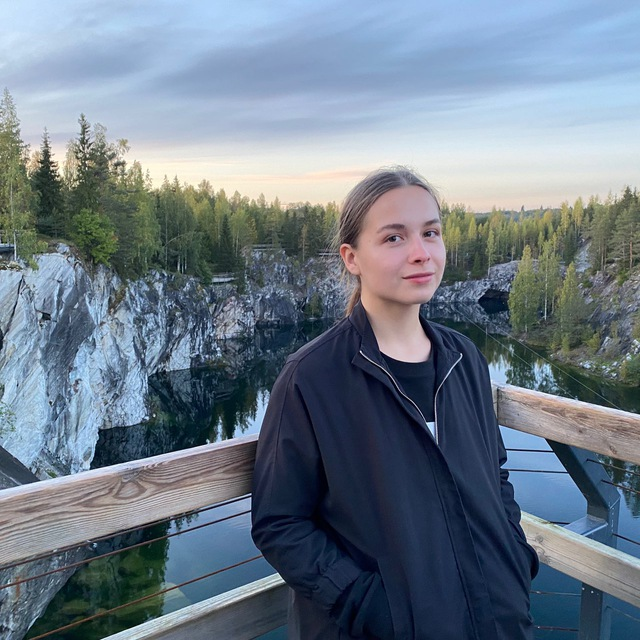

# Ekaterina Siomina


## Student of RS School

****

## Contact information
+ Email: [seminae99@gmail.com](seminae99@gmail.com)
+ Telegram: [Catunka](@Catunka)
+ Pinterest: [Kotes](@Cotestant)

****

## About me
My goal is to move to Stage1 and graduate with a certificate. I work and study at the university to become a biotechnologist, now I am in the 4th year out of 5. I have no experience in IT, but I have the desire. I learn quickly and easily absorb new information. I love sports (especially gaming), board games and PS4. At school, I knew how to do layout, learned to work in Figma and code in Python, but now everything is like the first time.
Мy motto is 4 words: help, help, help, help

****

## Code example
``` 
x1, y1, x2, y2 = int(input()), int(input()), int(input()), int(input())
k=x1+y1+x2+y2
if k%2==0:
    print('YES')
else:
    print('NO')
```
```
x1, y1, x2, y2 = int(input()), int(input()), int(input()), int(input())
if ((x1-x2==1) or (x1-x2==-1)) and ((y1-y2==2) or (y1-y2==-2)):
    print('YES')
elif ((x1-x2==2) or (x1-x2==-2)) and ((y1-y2==1) or (y1-y2==-1)):
    print('YES')
else:
    print('NO')
```

****

## Work experience
[CV on sololearn](https://sololearn.com/compiler-playground/WYCFGjXk6T35/?ref=app)

****

## Courses
* Sololearn:
    1. HTML 
    2. Python for Beginners 
    3. Python Data Structyres
* Stepik:
    1. Python (in progress)

****

## Languages
1. English - basic (A2)
2. French - elementary (A1)
3. Japanese - elementary (N4)
4. Russian - native